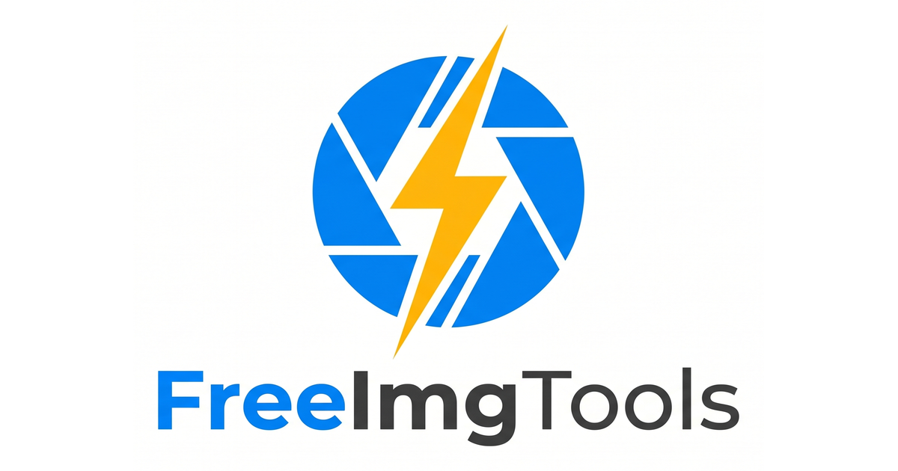

# FreeImgTools

FreeImgTools is a privacy-first collection of browser-based image utilities for compression, conversion, resizing, PDF workflows, GIF creation, platform-specific image preparation, and image SEO.

Live site: https://freeimgtools.net



## Why This Project Exists

Many image tools require uploading private files to a server, creating an account, waiting in a queue, or installing desktop software for a small one-time task. FreeImgTools focuses on quick, practical image workflows that run directly in the browser whenever possible.

Core tools such as compression, conversion, resizing, cropping, GIF creation, and image-to-PDF processing run locally on the user's device. This is useful for sensitive photos, application uploads, ID images, document scans, website images, and everyday creator workflows.

## Features

- Image compression with adjustable quality, EXIF stripping, batch processing, ZIP download, and target file sizes such as 20KB, 50KB, 100KB, 200KB, 240KB, and 500KB.
- Image format conversion between JPG, PNG, WebP, AVIF, GIF, BMP, and Base64 workflows.
- Image resizing with exact pixel dimensions and presets for YouTube, Discord, Instagram, TikTok, Open Graph, US visa photos, and more.
- PDF tools for converting PDF pages to images and combining photos into a PDF without Adobe, login, or upload queues.
- GIF maker for creating animated GIFs from multiple images.
- Image SEO tools and guides for alt text, filenames, compression, web performance, Open Graph images, and ecommerce/product images.
- AI-assisted image SEO utilities using Cloudflare Workers AI for optional alt text, caption, title, tag, and filename suggestions.

## Privacy Model

FreeImgTools is designed around local-first processing:

- Core image tools run in the browser using JavaScript, Canvas, PDF.js, jsPDF, and related browser APIs.
- Selected image files for core tools are not uploaded to a FreeImgTools server.
- AI features are the exception: they send the selected image to Cloudflare's edge AI inference service for analysis.
- Cloudflare Web Analytics is used for privacy-friendly traffic measurement.

Always review the live privacy policy before deploying your own instance or enabling analytics/AI features.

## Tech Stack

- Static HTML, CSS, and JavaScript
- Cloudflare Pages
- Cloudflare Pages Functions
- Cloudflare Workers AI
- Browser APIs for local image processing
- PDF.js and jsPDF for PDF-related workflows

## Repository Structure

```text
.
├── assets/              # Icons, social images, QR code, favicon assets
├── css/                 # Shared site styles
├── functions/api/       # Cloudflare Pages Functions for AI and audit endpoints
├── guides/              # Educational SEO and image optimization guides
├── js/                  # Browser-side tool logic
├── _redirects           # Cloudflare Pages redirects
├── _headers             # Cloudflare Pages headers
├── sitemap.xml          # Canonical sitemap
└── *.html               # Tool and landing pages
```

## Local Development

Install dependencies:

```bash
npm install
```

Run with Wrangler:

```bash
npm run dev
```

Wrangler serves the site with Cloudflare Pages behavior. Some AI features require Cloudflare bindings and will not fully work in a plain static server.

For quick static previews, you can also use:

```bash
python3 -m http.server 4174
```

Note that a plain static server does not emulate Cloudflare Pages clean URLs, redirects, headers, or Functions.

## Deploying to Cloudflare Pages

1. Fork or clone this repository.
2. Create a Cloudflare Pages project and connect the GitHub repository.
3. Leave the build command empty for a static deployment.
4. Add an AI binding named `AI` if you want to enable AI image analysis.
5. Configure any required environment variables for your deployment.
6. Push to the main branch to deploy.

## SEO and Content Principles

FreeImgTools uses focused landing pages and guides for real user tasks:

- Compress image to a target size
- Resize images for a specific platform
- Convert modern formats for compatibility
- Create or export PDFs without desktop software
- Improve image SEO with better filenames, alt text, and file size

When adding a page, prefer useful, specific workflows over thin keyword variations. Each page should have a clear user task, canonical URL, meta description, internal links, and practical guidance.

## Contributing

Contributions are welcome. See [CONTRIBUTING.md](CONTRIBUTING.md) for local setup, project principles, QA expectations, and pull request guidance.

Good first issues are listed here:

https://github.com/bianrui0315/freeimgtools/issues?q=is%3Aissue%20is%3Aopen%20label%3A%22good%20first%20issue%22

## Security

Please do not open public issues for security-sensitive reports. See [SECURITY.md](SECURITY.md) for private reporting instructions.

Do not commit API keys, Cloudflare tokens, OpenAI keys, private analytics credentials, or other secrets to this repository.

## Changelog

Notable project changes are tracked in [CHANGELOG.md](CHANGELOG.md).

## Maintainer

Maintained by Rui Bian.

- Website: https://freeimgtools.net
- Portfolio: https://bianrui.net
- GitHub: https://github.com/bianrui0315

## Contributors

Thanks to the people helping improve FreeImgTools:

- [@abu-pixel](https://github.com/abu-pixel) — added cross-links between PDF and image compression pages in [#4](https://github.com/bianrui0315/freeimgtools/pull/4).

## License

This project is released under the MIT License. See [LICENSE](LICENSE).
